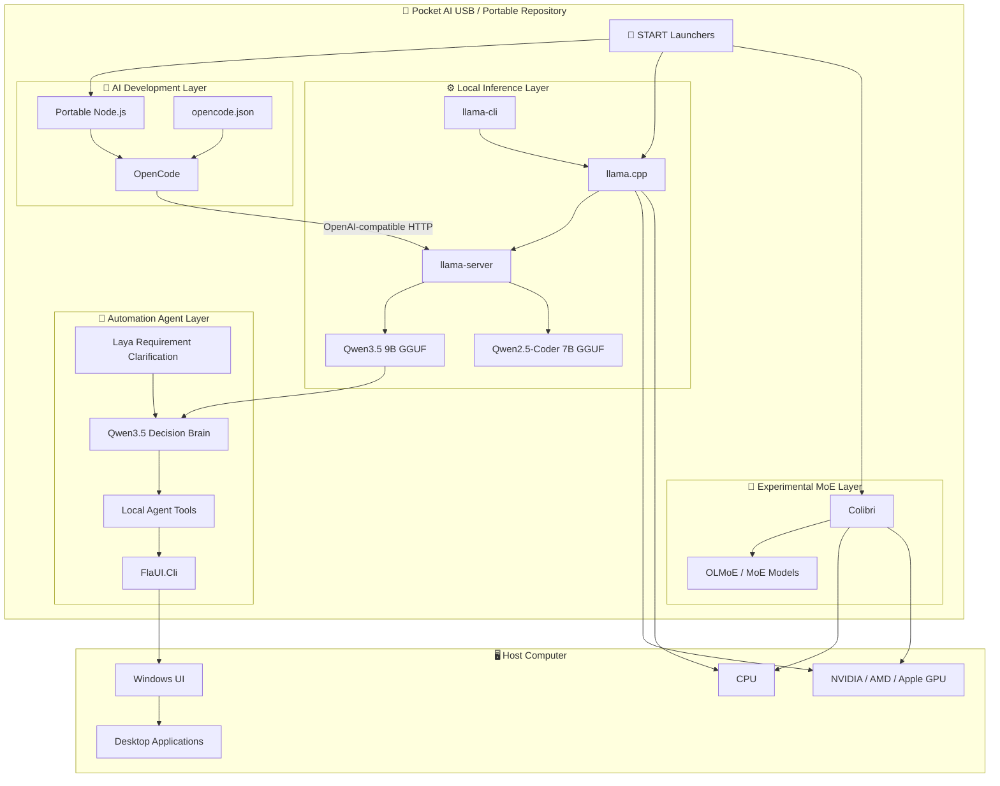
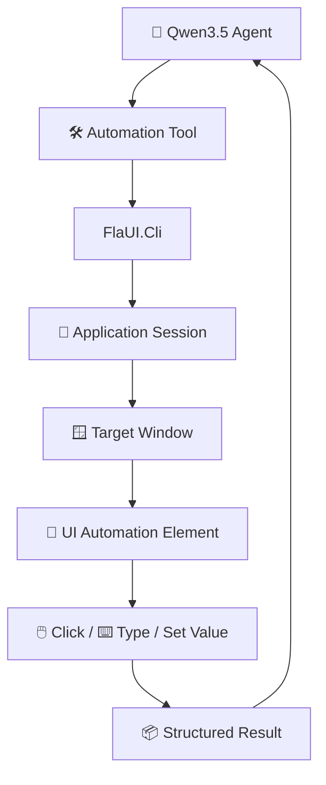
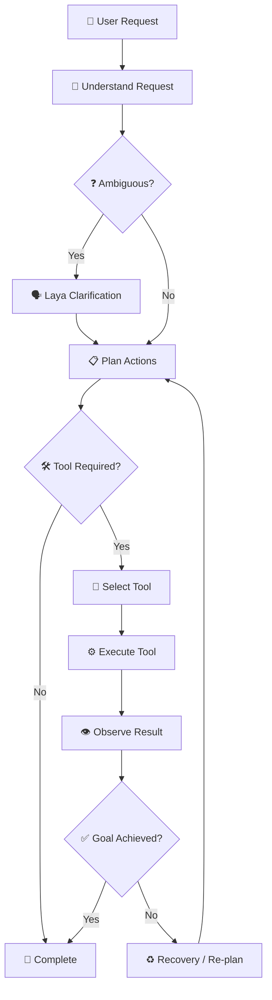
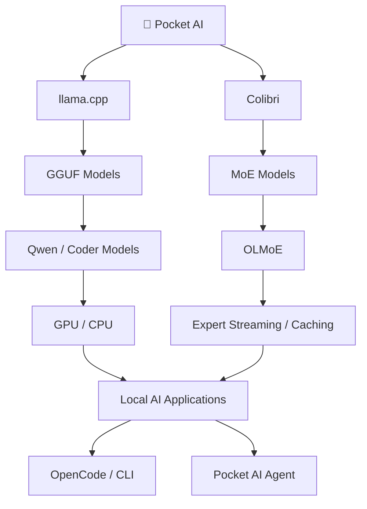
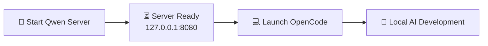
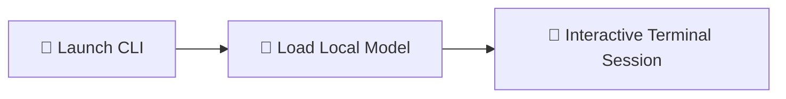
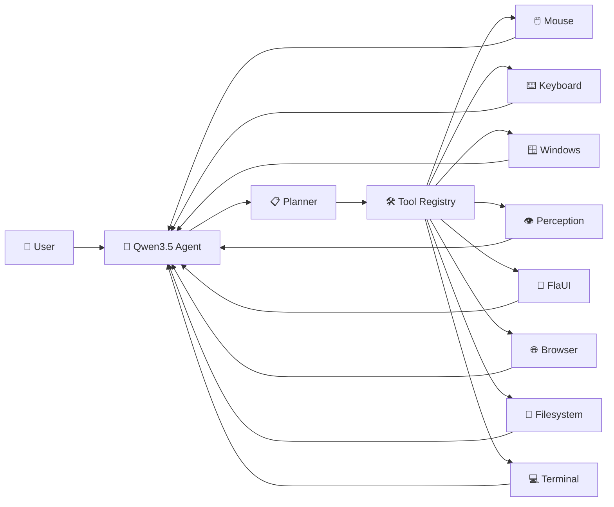
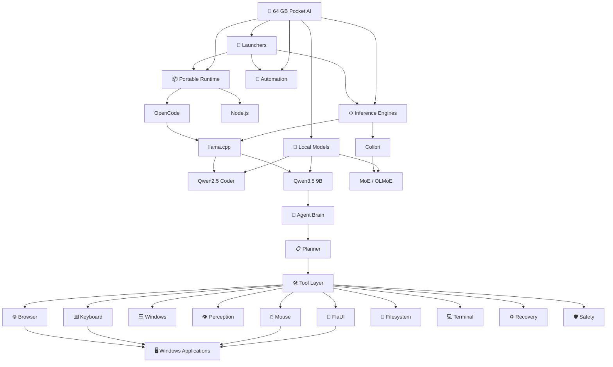
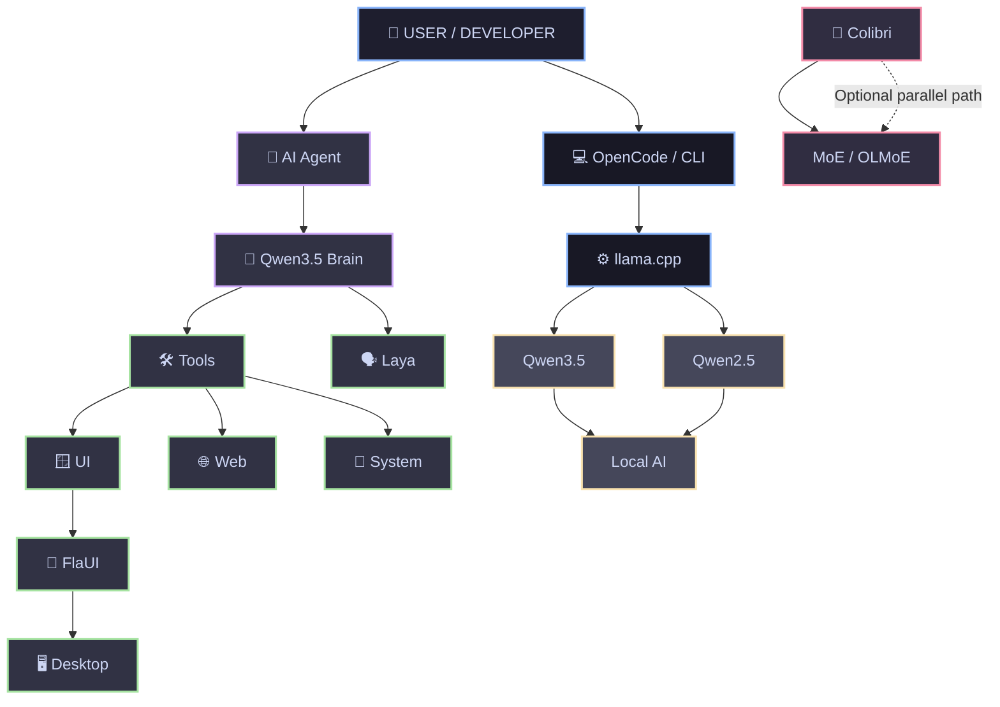

# ⚡ Pocket AI

## Cross-Platform Portable Local AI Development & Automation Environment

A **plug-and-play, self-contained local AI development environment** designed to live on a **64 GB USB drive**.

Pocket AI combines:

- 🧠 Local LLM inference with **llama.cpp**
- 💻 **OpenCode** for AI-assisted development
- 🛠️ Direct local **CLI inference**
- 🤖 A Windows computer-automation layer powered by **FlaUI**
- 🧩 Agent/tool orchestration for computer-use workflows
- 🗣️ Optional requirement clarification through **Laya**
- 🔬 **Colibri**, an experimental inference engine for MoE workloads
- 📦 Portable runtimes and launchers
- 🔒 Local-first execution with no mandatory cloud AI dependency

The original llama.cpp workflow remains the **primary and stable inference path**. New components are designed to be optional so that the existing local AI environment continues to work independently.

---

## 🗂️ Table of Contents

- [Architecture Overview](#-architecture-overview)
- [Core Design Principles](#-core-design-principles)
- [Directory Structure](#-directory-structure)
- [System Components](#-system-components)
- [LLM Inference Architecture](#-llm-inference-architecture)
- [AI Automation Architecture](#-ai-automation-architecture)
- [FlaUI Automation Layer](#-flaui-automation-layer)
- [Agent Execution Flow](#-agent-execution-flow)
- [Colibri MoE Engine](#-colibri-moe-engine)
- [Launchers & Portability Mechanics](#-launchers--portability-mechanics)
- [Operational Workflows](#-operational-workflows)
- [Configuration Reference](#-configuration-reference)
- [Safety & Execution Boundaries](#-safety--execution-boundaries)
- [Deployment Checklist](#-deployment-checklist)
- [Current Platform Status](#-current-platform-status)
- [Roadmap](#-roadmap)

---

# 🏗️ Architecture Overview

Pocket AI is organized as several cooperating local layers rather than a single AI application.



### High-level execution model

```text
User
 │
 ├──► OpenCode / CLI
 │       │
 │       └──► llama.cpp
 │               │
 │               └──► Local GGUF Model
 │
 └──► Pocket AI Agent
         │
         ├──► Qwen3.5 Decision Brain
         │
         ├──► Laya (when clarification is required)
         │
         └──► Local Tools
                 │
                 ├──► Mouse / Keyboard
                 ├──► Windows
                 ├──► Perception
                 ├──► FlaUI / UI Automation
                 ├──► Browser
                 ├──► Filesystem
                 ├──► Terminal
                 ├──► Planner
                 ├──► Recovery
                 └──► Memory / Safety
```

---

# 🎯 Core Design Principles

| Principle | Description |
|---|---|
| **Portable** | The environment is designed to run from a removable drive/repository. |
| **Local-first** | LLM inference can run locally without sending prompts to a hosted AI provider. |
| **No global dependency** | Runtime binaries and project dependencies are kept inside the Pocket AI environment where practical. |
| **Drive-letter agnostic** | Windows launchers resolve their location dynamically instead of assuming `E:\`. |
| **Platform-aware** | Windows, Linux and macOS have separate runtime/launcher paths where required. |
| **Modular** | llama.cpp, automation, and Colibri are separate components. |
| **Optional experimental features** | Experimental engines must not break the stable llama.cpp workflow. |
| **Tool-driven agents** | The AI decides when a computer tool is required instead of directly manipulating the OS without a tool boundary. |
| **Safety boundaries** | Automation is separated into explicit tools and execution layers. |

---

# 📂 Directory Structure

The repository has evolved from the original simple AI layout into a multi-component Pocket AI environment.

```text
Pocket-AI/
│
├── 📁 AI/
│   ├── 📁 config/
│   │   └── 📄 opencode.json
│   │
│   ├── 📁 node-windows/
│   ├── 📁 node-linux/
│   ├── 📁 node-macos/
│   │
│   ├── 📁 opencode-windows/
│   ├── 📁 opencode-linux/
│   └── 📁 opencode-macos/
│
├── 📁 Android/
│   └── 📱 Android / mobile-side components
│
├── 📁 Colibri/
│   └── 🔬 Experimental Colibri / MoE inference work
│
├── 📁 Dumb/
│   └── 🧪 Auxiliary / experimental components
│
├── 📁 FlaUI.Cli/
│   ├── 📁 src/
│   │   └── 📁 FlaUI.Cli/
│   └── 🖥️ Windows UI Automation CLI
│
├── 📁 Start/
│   ├── 📁 Windows/
│   │   ├── 🚀 opencode.bat
│   │   ├── 🚀 qwen35-server.bat
│   │   ├── 🚀 qwen25-server.bat
│   │   ├── 🚀 qwen35-cli.bat
│   │   ├── 🚀 qwen25-cli.bat
│   │   └── 🤖 automation / agent launchers
│   │
│   ├── 📁 Linux/
│   │   ├── 🚀 opencode-linux.sh
│   │   ├── 🚀 qwen35-server-linux.sh
│   │   ├── 🚀 qwen25-server-linux.sh
│   │   ├── 🚀 qwen35-cli-linux.sh
│   │   ├── 🚀 qwen25-cli-linux.sh
│   │   └── 🔬 Colibri launchers
│   │
│   └── 📁 macOS/
│       ├── 🚀 opencode-macos.sh
│       ├── 🚀 qwen35-server-macos.sh
│       ├── 🚀 qwen25-server-macos.sh
│       ├── 🚀 qwen35-cli-macos.sh
│       └── 🚀 qwen25-cli-macos.sh
│
├── 📁 server/
│   ├── 📁 llama/
│   │   └── llama.cpp CPU / portable binaries
│   │
│   └── 📁 llama-gpu/
│       └── llama.cpp GPU-enabled binaries / DLLs
│
├── 📄 README.md
└── ...
```

## Current model/runtime concept

```text
Pocket-AI/
│
├── AI/
│   ├── config/
│   │   └── opencode.json
│   ├── node-*/
│   └── opencode-*/
│
├── server/
│   ├── llama/
│   │   └── llama-server / llama-cli
│   └── llama-gpu/
│       └── llama-server.exe / llama-cli.exe / DLLs
│
├── Colibri/
├── FlaUI.Cli/
├── Android/
├── Dumb/
└── Start/
```

> **Note:** Model files may be stored separately from the runtime binaries depending on the current Pocket AI deployment. Keep large GGUF/model assets out of source control unless the repository intentionally distributes them.

---

# 🧩 System Components

| Component | Platform | Role |
|---|---|---|
| **Portable Node.js** | Windows / Linux / macOS | Runs OpenCode and JavaScript/TypeScript tooling. |
| **OpenCode** | Windows / Linux / macOS | AI-assisted development interface. |
| **llama.cpp** | Windows / Linux / macOS | Primary local LLM inference engine. |
| **llama-server** | Windows / Linux / macOS | Exposes local models through an OpenAI-compatible API. |
| **llama-cli** | Windows / Linux / macOS | Direct terminal inference. |
| **Qwen2.5-Coder-7B** | Local GGUF | Coding-focused model. |
| **Qwen3.5-9B** | Local GGUF | General/reasoning model and agent decision brain. |
| **FlaUI.Cli** | Windows | Structured Windows UI Automation. |
| **Agent Tools** | Primarily Windows | Expose computer actions to the local AI agent. |
| **Laya** | Optional | Requirement/ambiguity clarification layer. |
| **Colibri** | Experimental | Alternative inference path for MoE workloads. |

---

# 🧠 LLM Inference Architecture

The stable Pocket AI inference path is:

```text
                 ┌──────────────────┐
                 │     OpenCode     │
                 └────────┬─────────┘
                          │
                          │ OpenAI-compatible API
                          ▼
                 ┌──────────────────┐
                 │   llama-server   │
                 │ 127.0.0.1:8080  │
                 └────────┬─────────┘
                          │
             ┌────────────┴────────────┐
             ▼                         ▼
     ┌────────────────┐       ┌────────────────┐
     │ Qwen3.5 9B     │       │ Qwen2.5 Coder  │
     │ General / Brain│       │ Coding Model   │
     └────────────────┘       └────────────────┘
```

Only one model server should normally occupy the configured `8080` endpoint at a time.

---

# 🤖 AI Automation Architecture

Pocket AI's automation system extends the local LLM from a coding assistant into a **computer-use agent**.

The important separation is:

```text
                 ┌────────────────────────┐
                 │       User Request      │
                 └────────────┬───────────┘
                              ▼
                 ┌────────────────────────┐
                 │   Qwen3.5 Agent Brain  │
                 └────────────┬───────────┘
                              │
                    Decide required action
                              │
                              ▼
                 ┌────────────────────────┐
                 │      Tool Layer        │
                 └────────────┬───────────┘
                              │
          ┌───────────────────┼───────────────────┐
          ▼                   ▼                   ▼
      Mouse/Keyboard       Windows/UI         Browser
          │                   │                   │
          └───────────────────┼───────────────────┘
                              ▼
                       Windows/Desktop
```

The agent should not need to know the low-level implementation details of every operation. Tools provide controlled capabilities and return structured results to the model.

---

# 🖥️ Automation Tool Stack

The automation layer is organized progressively:

```text
1. Mouse
       ↓
2. Keyboard
       ↓
3. Windows
       ↓
4. Perception
       ↓
5. UI Automation
       ↓
6. Browser
       ↓
7. Filesystem
       ↓
8. Terminal
       ↓
9. Planner
       ↓
10. Recovery
       ↓
11. Memory
       ↓
12. Safety
```

This allows individual capabilities to be tested independently before being composed into a larger agent.

---


# 🪟 FlaUI Automation Layer

**FlaUI.Cli** is the structured Windows UI Automation layer used by Pocket AI.

It provides command-oriented access to Windows applications and UI Automation elements.

### Current CLI capability groups

```text
FlaUI.Cli
│
├── session
│   ├── new
│   ├── attach
│   ├── status
│   └── end
│
├── elem
│   ├── find
│   ├── tree
│   ├── props
│   ├── click
│   ├── type
│   └── set-value
│
├── window
│   └── window management / inspection
│
├── wait
├── record
├── audit
├── batch
├── screenshot
└── report
```

### Automation model



This creates a clear boundary between the AI's decision-making and Windows UI execution.

---

# 🧠 Agent Execution Flow

The intended computer-use flow is:



### Example

User:

```text
Open Notepad and write a Python program to find
the maximum of two numbers.
```

Agent conceptually performs:

```text
User Request
    ↓
Qwen3.5
    ↓
Understand "open Notepad + type code"
    ↓
Launch/attach to Notepad
    ↓
Find Notepad window
    ↓
Find editable text area
    ↓
Type generated Python code
    ↓
Verify text/action result
    ↓
Report completion
```

---

# 🔬 Colibri MoE Engine

## Status: 🟡 Experimental

Colibri is an **additional inference engine** being explored alongside llama.cpp.

It is intended for **Mixture-of-Experts (MoE)** workloads and must remain independent from the stable llama.cpp setup.

The existing llama.cpp environment remains the primary Pocket AI inference engine.

---

## Colibri Architecture



### OLMoE experimental target

The Colibri work has been explored with:

```text
allenai/OLMoE-1B-7B-0125-Instruct
```

The experimental conversion/workflow has included a merged OLMoE model representation and investigation of expert streaming.

---

# 📦 Planned Colibri Integration

The long-term architecture keeps Colibri beside llama.cpp rather than replacing it.

```text
Pocket-AI/
│
├── AI/
│
├── server/
│   ├── llama/
│   └── llama-gpu/
│
├── Colibri/
│   ├── colibri-windows/     # Planned
│   ├── colibri-linux/       # Experimental / planned integration
│   └── models/
│       └── olmoe_merged/
│
├── FlaUI.Cli/
├── Android/
├── Dumb/
└── Start/
```

### Important design rule

> **Colibri must remain optional. Existing llama.cpp launchers and workflows must continue to work without Colibri.**

---

# 🚀 Launchers & Portability Mechanics

Pocket AI launchers should resolve paths relative to the launcher location instead of depending on a fixed drive letter or mount point.

This allows:

```text
E:\Pocket-AI
D:\Pocket-AI
/media/user/Pocket-AI
/Volumes/Pocket-AI
```

to work without rewriting configuration for each machine.

---

## POSIX Path Resolution

```bash
#!/usr/bin/env bash

SCRIPT_DIR="$(cd "$(dirname "${BASH_SOURCE[0]}")" && pwd)"
USB_ROOT="$(cd "${SCRIPT_DIR}/../.." && pwd)"

NODE_PATH="${USB_ROOT}/AI/node-linux"
OPENCODE_PATH="${USB_ROOT}/AI/opencode-linux"

export PATH="${NODE_PATH}:${OPENCODE_PATH}:${PATH}"
```

---

## Windows Batch Path Resolution

```cmd
@echo off
setlocal

set "USB=%~dp0..\.."
for %%I in ("%USB%") do set "USB=%%~fI"

set "NODE_HOME=%USB%\AI\node-windows"
set "PATH=%NODE_HOME%;%PATH%"
```

---

# 🔄 Operational Workflows

## Mode A — Full IDE Mode



### Windows

```cmd
START\Windows\qwen35-server.bat
START\Windows\opencode.bat
```

Or use the Qwen2.5 Coder server:

```cmd
START\Windows\qwen25-server.bat
START\Windows\opencode.bat
```

### Linux

```bash
chmod +x START/Linux/*.sh

./START/Linux/qwen35-server-linux.sh
./START/Linux/opencode-linux.sh
```

### macOS

```bash
chmod +x START/macOS/*.sh

./START/macOS/qwen35-server-macos.sh
./START/macOS/opencode-macos.sh
```

---

# 💬 Mode B — Direct CLI Mode



| Platform | Qwen3.5 CLI | Qwen2.5 Coder CLI |
|---|---|---|
| Windows | `START\Windows\qwen35-cli.bat` | `START\Windows\qwen25-cli.bat` |
| Linux | `./START/Linux/qwen35-cli-linux.sh` | `./START/Linux/qwen25-cli-linux.sh` |
| macOS | `./START/macOS/qwen35-cli-macos.sh` | `./START/macOS/qwen25-cli-macos.sh` |

GPU-capable configurations can use aggressive layer offloading such as `-ngl 99` where supported by the installed llama.cpp build and available VRAM.

> ⚠️ **Model switch:** the normal single-port configuration uses `127.0.0.1:8080`. Stop the current server before launching another model server on the same port.

---

# 🤖 Mode C — Pocket AI Automation Agent

The automation workflow extends the local model into computer-use tasks.



The agent follows an iterative pattern:

```text
PLAN → ACT → OBSERVE → VERIFY → RECOVER / COMPLETE
```

---

# ⚙️ Configuration Reference

OpenCode communicates with llama-server using an OpenAI-compatible API.

### `AI/config/opencode.json`

```json
{
  "$schema": "https://opencode.ai/config.json",
  "provider": {
    "llama.cpp": {
      "npm": "@ai-sdk/openai-compatible",
      "name": "llama.cpp - Local Qwen Models",
      "options": {
        "baseURL": "http://127.0.0.1:8080/v1"
      },
      "models": {
        "qwen3.5-9b": {
          "name": "Qwen3.5-9B Q4_K_M",
          "limit": {
            "context": 16384,
            "output": 8192
          }
        },
        "qwen2.5-coder-7b": {
          "name": "Qwen2.5-Coder-7B Q4_K_M",
          "limit": {
            "context": 16384,
            "output": 8192
          }
        }
      }
    }
  },
  "model": "llama.cpp/qwen3.5-9b"
}
```

### Default endpoint

```text
http://127.0.0.1:8080/v1
```

This keeps the model API local to the host machine.

---

# 🛡️ Safety & Execution Boundaries

Pocket AI's automation architecture intentionally separates:

```text
AI Decision
     ↓
Tool Selection
     ↓
Tool Execution
     ↓
Result
     ↓
AI Verification
```

This is important because the model should **decide what it wants to accomplish**, while dedicated tools perform the actual operating-system actions.

### Important boundaries

- Do not allow an LLM response to execute arbitrary OS actions without a tool boundary.
- Prefer structured tool arguments and structured results.
- Verify application/session state before interacting with it.
- Verify the result after an action.
- Use recovery/re-planning when an action fails.
- Keep experimental engines independent from stable inference.
- Destructive actions should require appropriate confirmation/safety handling.

---

# 📋 Deployment Checklist

## 1. Portable files

- [ ] `AI/` exists
- [ ] `server/` exists
- [ ] `Start/` exists
- [ ] `FlaUI.Cli/` exists when Windows automation is required
- [ ] `Colibri/` exists only when the experimental engine is required

## 2. Models

- [ ] Required GGUF model files are present
- [ ] Model filenames match launcher configuration
- [ ] Model files are not accidentally omitted from the deployment

## 3. Windows

- [ ] Portable Node.js is present
- [ ] OpenCode is present
- [ ] llama.cpp CPU/GPU binaries are present
- [ ] Required GPU DLLs are present for GPU builds
- [ ] FlaUI CLI is built/available for automation
- [ ] Python automation environment is available where required

## 4. Linux

```bash
chmod +x START/Linux/*.sh
```

Verify:

- [ ] Node.js runtime
- [ ] OpenCode
- [ ] llama.cpp
- [ ] GPU runtime/driver when GPU acceleration is required

## 5. macOS

```bash
chmod +x START/macOS/*.sh
```

Verify:

- [ ] Node.js runtime
- [ ] OpenCode
- [ ] llama.cpp
- [ ] Metal-capable build where required

## 6. Local API

Verify:

```text
127.0.0.1:8080
```

is available before launching OpenCode against the local server.

---

# 🌍 Current Platform Status

| Feature | Windows | Linux | macOS |
|---|:---:|:---:|:---:|
| Portable Node.js | ✅ | ✅ | ✅ |
| OpenCode | ✅ | ✅ | ✅ |
| llama.cpp | ✅ | ✅ | ✅ |
| Qwen GGUF | ✅ | ✅ | ✅ |
| Direct CLI | ✅ | ✅ | ✅ |
| OpenAI-compatible server | ✅ | ✅ | ✅ |
| FlaUI automation | ✅ | — | — |
| Pocket AI Agent | 🟡 Active development | 🟡 Development | 🟡 Development |
| Colibri | 🟡 Planned integration | 🟡 Experimental | 🟡 Future |
| OLMoE / MoE testing | 🟡 Investigation | 🟡 Tested/experimental | 🟡 Future |

`—` means the component is platform-specific or not currently targeted.

---

# 🔬 Colibri Platform Status

| Platform | Status |
|---|---|
| Google Colab / Linux | ✅ Experimental testing |
| Native Linux | 🟡 Validation / integration |
| Windows | 🟡 Future portable integration |
| Windows + RTX 5050 | 🟡 GPU investigation |
| macOS | 🟡 Future investigation |

The llama.cpp stack remains the primary inference path regardless of Colibri's development status.

---

# 🗺️ Roadmap

## 🧠 Local AI

- [x] Portable llama.cpp environment
- [x] Qwen2.5 Coder local inference
- [x] Qwen3.5 local inference
- [x] OpenAI-compatible local API
- [x] OpenCode integration
- [x] CPU/GPU launcher separation
- [ ] Automatic hardware/model selection
- [ ] Unified Pocket AI launcher/menu

## 🤖 Computer Automation

- [x] Tool-based automation architecture
- [x] FlaUI.Cli integration work
- [x] Windows session management
- [x] UI element discovery
- [x] Click/type/set-value primitives
- [x] Screenshot/report/audit capabilities
- [x] Agent → tool → result architecture
- [ ] More robust application/session recovery
- [ ] Stronger perception layer
- [ ] Browser automation integration
- [ ] Planner/recovery improvements
- [ ] Long-term agent memory
- [ ] Expanded safety/confirmation layer

## 🔬 Colibri

- [x] Separate Colibri research path
- [x] OLMoE experimental work
- [x] Initial Colab/Linux experimentation
- [ ] Native Linux validation
- [ ] Portable Windows executable
- [ ] RTX 5050 GPU investigation
- [ ] Portable Colibri launchers
- [ ] Model storage integration
- [ ] OpenCode/API integration
- [ ] Automatic engine/model detection
- [ ] Health/diagnostic checks
- [ ] llama.cpp vs Colibri benchmarking
- [ ] Keep Colibri completely optional

---

# 🧭 Pocket AI — Complete Concept



---

# 🚀 Vision

Pocket AI is evolving from a **portable local LLM environment** into a broader **portable local AI computer platform**.

The architecture is intentionally layered:



> **Pocket AI is designed to keep the entire stack local, portable, modular, and replaceable — from the model and inference engine all the way to computer-use tools.**

---

## 📌 Project Status

Pocket AI is an actively evolving project.

The stable foundation is:

**Portable Runtime → OpenCode / CLI → llama.cpp → Local Models**

The next layer is:

**Qwen3.5 → Agent → Tools → Windows / UI / Browser / Filesystem / Terminal**

And the experimental parallel engine is:

**Colibri → MoE / OLMoE**

Each layer can continue to evolve independently without requiring the entire system to be rebuilt.
