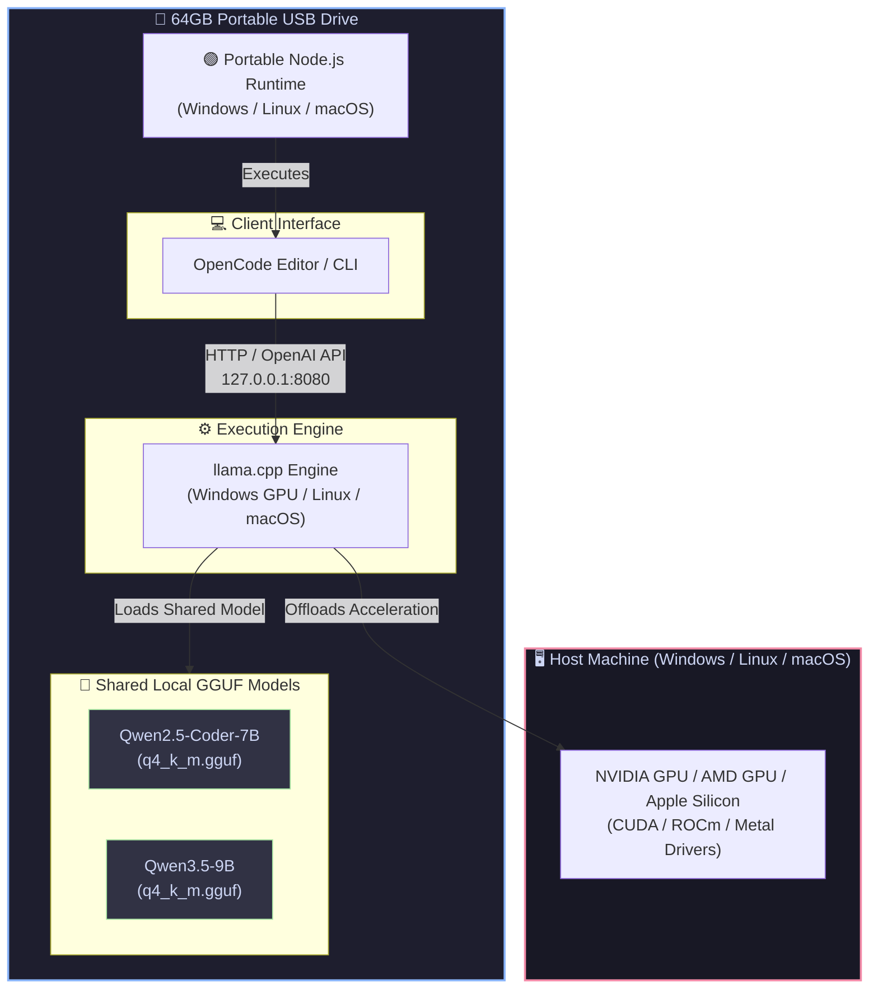
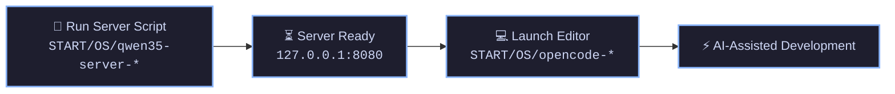
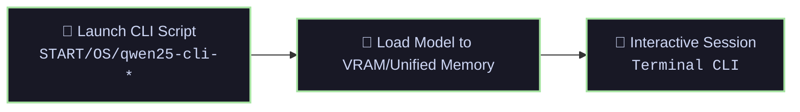
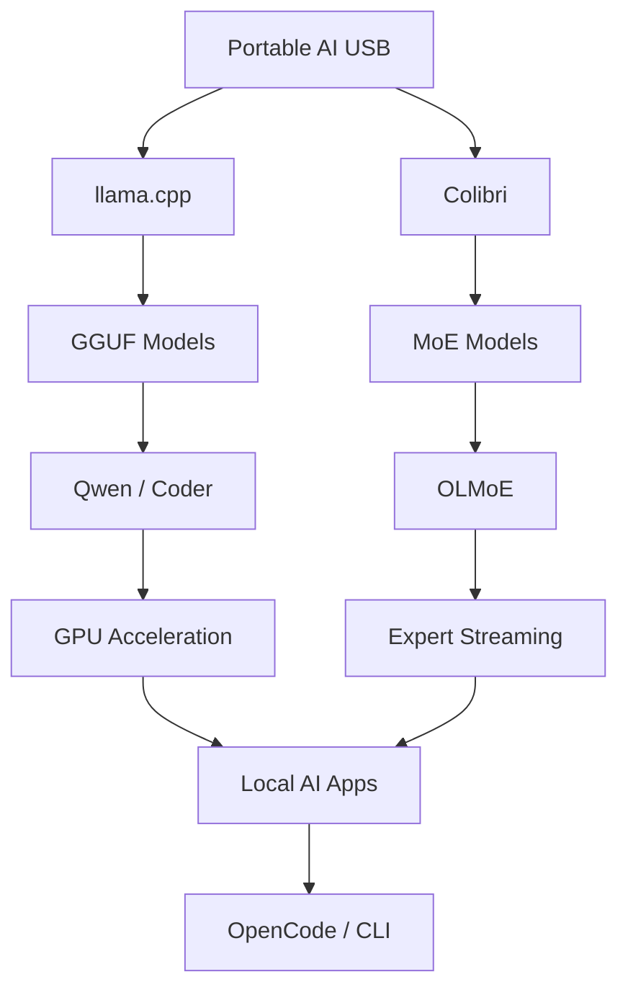

# ⚡ Cross-Platform Portable AI Development Environment - Pocket AI

## A plug-and-play, fully self-contained local AI development environment hosted entirely on a **64 GB USB drive**. Move seamlessly between **Windows**, **Linux**, and **macOS** host systems with zero global installations or configuration friction.


---


## 🗂️ Table of Contents

* [Architecture Overview](#-architecture-overview)
* [Directory Structure](#-directory-structure)
* [System Components](#-system-components)
* [Launchers & Portability Mechanics](#-launchers--portability-mechanics)
* [Operational Workflows](#-operational-workflows)
* [Configuration Reference](#-configuration-reference)
* [Deployment Checklist](#-deployment-checklist)

---

## 🏗️ Architecture Overview

The diagram below illustrates the cross-platform communication flow and local execution boundary of the portable stack:



---

## 📂 Directory Structure

A clean, multi-platform layout separating platform-specific binaries, shared model assets, and launch scripts:

```text
USB_ROOT (Drive-Letter & Mount-Point Agnostic)
 ├── 📁 AI/
 │    ├── 📁 config/
 │    │    └── 📄 opencode.json          # Provider & endpoint configuration
 │    ├── 📁 node-windows/              # Portable Node.js (Windows)
 │    ├── 📁 opencode-windows/          # OpenCode installation (Windows)
 │    ├── 📁 node-linux/                # Portable Node.js (Linux)
 │    ├── 📁 opencode-linux/            # OpenCode installation (Linux)
 │    ├── 📁 node-macos/                # Portable Node.js (macOS)
 │    └── 📁 opencode-macos/            # OpenCode installation (macOS)
 │
 ├── 📁 models/
 │    └── 📁 llama/
 │         ├── 📁 llama-gpu/             # Windows GPU binaries & DLLs
 │         │    ├── ⚙️ llama-server.exe
 │         │    └── ⚙️ llama-cli.exe
 │         ├── 📁 llama-linux/           # Linux binaries
 │         │    ├── ⚙️ llama-server
 │         │    └── ⚙️ llama-cli
 │         ├── 📁 llama-macos/           # macOS Metal binaries
 │         │    ├── ⚙️ llama-server
 │         │    └── ⚙️ llama-cli
 │         └── 📁 models/                # Shared GGUF Quantized Model Storage
 │              ├── 🧠 qwen2.5-coder-7b-instruct-q4_k_m.gguf
 │              └── 🧠 Qwen3.5-9B-The-Defiant-Fable-Uncnr-Heretic-NEO-MAX-Q4_K_M.gguf
 │
 └── 📁 START/                           # Consolidated Execution Launchers
      ├── 📁 Windows/
      │    ├── 🚀 opencode.bat
      │    ├── 🚀 qwen35-server.bat
      │    ├── 🚀 qwen25-server.bat
      │    ├── 🚀 qwen35-cli.bat
      │    └── 🚀 qwen25-cli.bat
      ├── 📁 Linux/
      │    ├── 🚀 opencode-linux.sh
      │    ├── 🚀 qwen35-server-linux.sh
      │    ├── 🚀 qwen25-server-linux.sh
      │    ├── 🚀 qwen35-cli-linux.sh
      │    └── 🚀 qwen25-cli-linux.sh
      └── 📁 macOS/
           ├── 🚀 opencode-macos.sh
           ├── 🚀 qwen35-server-macos.sh
           ├── 🚀 qwen25-server-macos.sh
           ├── 🚀 qwen35-cli-macos.sh
           └── 🚀 qwen25-cli-macos.sh
```

---

## 🧩 System Components

| Component | Target OS | Details & Path | Role in Environment |
| :--- | :--- | :--- | :--- |
| **Node.js Runtime** | Windows / Linux / macOS | `AI/node-*` | Native runtimes driving OpenCode & JS/TS developer toolchains. |
| **OpenCode** | Windows / Linux / macOS | `AI/opencode-*` | AI-assisted development IDE bound to the local model API endpoint. |
| **llama.cpp Engine** | Windows / Linux / macOS | `models/llama/llama-*` | High-performance C++ inference engine with CUDA/Metal acceleration. |
| **Qwen2.5 Coder 7B** | Shared | `models/llama/models/qwen2.5-coder-7b...` | Specialized model targeted at fast code generation and inline completions. |
| **Qwen3.5 9B** | Shared | `models/llama/models/Qwen3.5-9B...` | High-capacity reasoning assistant for complex architectural tasks. |

---

## 🛠️ Launchers & Portability Mechanics

All launchers dynamically compute the USB root path from their execution directory, eliminating hardcoded drive letters (`E:\`) or fixed Unix mount paths (`/media/user/USB` or `/Volumes/USB`).

### POSIX Path Resolution Pattern (`.sh`)

```bash
#!/usr/bin/env bash
# Calculate USB Root relative to script location
SCRIPT_DIR="$(cd "$(dirname "${BASH_SOURCE[0]}")" && pwd)"
USB_ROOT="$(cd "${SCRIPT_DIR}/../.." && pwd)"

# Resolve relative paths
NODE_PATH="${USB_ROOT}/AI/node-linux"
OPENCODE_PATH="${USB_ROOT}/AI/opencode-linux"
export PATH="${NODE_PATH}:${OPENCODE_PATH}:${PATH}"
```

### Batch Path Resolution Pattern (`.bat`)

```cmd
@echo off
setlocal
:: Resolve USB root from parent directory
set "USB=%~dp0..\.."
for %%I in ("%USB%") do set "USB=%%~fI"

set "NODE_HOME=%USB%\AI\node-windows"
set "PATH=%NODE_HOME%;%PATH%"
```

---

## 🔄 Operational Workflows

### Mode A: Full IDE Mode (OpenCode + Local Server)



#### Windows
1. Run `START\Windows\qwen35-server.bat` (or `qwen25-server.bat`).
2. Run `START\Windows\opencode.bat`.

#### Linux
```bash
# First time setup only:
chmod +x START/Linux/*.sh

# Launch Server & OpenCode
./START/Linux/qwen35-server-linux.sh
./START/Linux/opencode-linux.sh
```

#### macOS
```bash
# First time setup only:
chmod +x START/macOS/*.sh

# Launch Server & OpenCode
./START/macOS/qwen35-server-macos.sh
./START/macOS/opencode-macos.sh
```

---

### Mode B: Direct CLI Terminal Mode



#### Execution Commands

| Target OS | Qwen3.5 CLI Command | Qwen2.5 Coder CLI Command | Notes |
| :--- | :--- | :--- | :--- |
| **Windows** | `START\Windows\qwen35-cli.bat` | `START\Windows\qwen25-cli.bat` | Uses `-ngl 99` GPU offloading |
| **Linux** | `./START/Linux/qwen35-cli-linux.sh` | `./START/Linux/qwen25-cli-linux.sh` | Uses `-ngl 99` GPU offloading |
| **macOS** | `./START/macOS/qwen35-cli-macos.sh` | `./START/macOS/qwen25-cli-macos.sh` | Auto-detects Metal / Unified Memory |

> **⚠️ Model Switch Notice:** Single-port (`8080`) configurations permit one active model process at a time. Close the running server process before launching another model server.

---

## ⚙️ Configuration Reference

OpenCode communicates with `llama-server` via an OpenAI-compatible interface:

*Path: `AI/config/opencode.json`*

```json
{
  "$schema": "https://opencode.ai/config.json",
  "provider": {
    "llama.cpp": {
      "npm": "@ai-sdk/openai-compatible",
      "name": "llama.cpp - Local Qwen Models",
      "options": {
        "baseURL": "http://127.0.0.1:8080/v1"
      },
      "models": {
        "qwen3.5-9b": {
          "name": "Qwen3.5-9B Q4_K_M",
          "limit": {
            "context": 16384,
            "output": 8192
          }
        },
        "qwen2.5-coder-7b": {
          "name": "Qwen2.5-Coder-7B Q4_K_M",
          "limit": {
            "context": 16384,
            "output": 8192
          }
        }
      }
    }
  },
  "model": "llama.cpp/qwen3.5-9b"
}
```

---

## 📋 Deployment Checklist

Verify environment status when attaching the drive to a target system:

### 1. Unix Execution Permissions (Linux & macOS)
```bash
chmod +x START/Linux/*.sh START/macOS/*.sh
```

### 2. Assets & Binaries Checklist
- [ ] **Shared Models**: `models/llama/models/*.gguf` present and intact.
- [ ] **Windows Support**: `AI/node-windows`, `AI/opencode-windows`, `models/llama/llama-gpu` exist.
- [ ] **Linux Support**: `AI/node-linux`, `AI/opencode-linux`, `models/llama/llama-linux` exist with execute permissions.
- [ ] **macOS Support**: `AI/node-macos`, `AI/opencode-macos`, `models/llama/llama-macos` exist with execute permissions.
- [ ] **Configuration**: `AI/config/opencode.json` present.


## 🚀 Upcoming Feature — Colibri MoE Engine

> **Status:** 🟡 Experimental / Upcoming
> **Current validated environment:** Google Colab / Linux
> **Windows portable integration:** Planned

Colibri will be added as an additional inference engine for **Mixture-of-Experts (MoE) models**, alongside the existing llama.cpp engine.

Unlike the current GGUF/llama.cpp workflow, Colibri is designed to stream and cache MoE experts from disk, allowing large MoE models to be explored on systems with more limited RAM.

### 🧠 Architecture




### 💾 Planned USB Integration

The long-term goal is to integrate Colibri into the existing portable USB architecture without disturbing the current llama.cpp installation.

Proposed structure:

```text
USB_ROOT/
│
├── AI/
│   ├── config/
│   ├── node-windows/
│   ├── node-linux/
│   ├── node-macos/
│   ├── opencode-windows/
│   ├── opencode-linux/
│   └── opencode-macos/
│
├── models/
│   ├── llama/
│   │   ├── llama-gpu/
│   │   ├── llama-linux/
│   │   ├── llama-macos/
│   │   └── models/
│   │
│   └── colibri/
│       ├── colibri-windows/       # Planned
│       ├── colibri-linux/         # Planned
│       └── models/
│           └── olmoe_merged/
│
└── START/
    ├── Windows/
    │   ├── qwen35-server.bat
    │   ├── qwen25-server.bat
    │   └── colibri-olmoe.bat      # Planned
    │
    ├── Linux/
    │   ├── qwen35-server-linux.sh
    │   ├── qwen25-server-linux.sh
    │   └── colibri-olmoe-linux.sh # Planned
    │
    └── macOS/
        └── ...
```

### ⚠️ Current Platform Status

| Platform             | Colibri Status              |
| -------------------- | --------------------------- |
| Google Colab / Linux | ✅ Tested                    |
| Linux local machine  | 🟡 Planned validation       |
| Windows              | 🟡 Future integration       |
| Windows + RTX 5050   | 🟡 Future GPU investigation |
| macOS                | 🟡 Future investigation     |

The existing **llama.cpp environment remains the primary portable AI engine**. Colibri is an additional experimental engine specifically intended for MoE workloads.

### 🎯 Future Goals

* [ ] Validate Colibri on native Linux
* [ ] Build a Windows-compatible Colibri executable
* [ ] Investigate NVIDIA GPU/RTX 5050 support
* [ ] Add portable Colibri launchers
* [ ] Add OLMoE model storage to the USB structure
* [ ] Integrate Colibri's API with OpenCode
* [ ] Add automatic engine/model detection
* [ ] Add Colibri health and diagnostic checks
* [ ] Benchmark Colibri vs llama.cpp for compatible MoE models
* [ ] Keep the entire feature optional so the existing llama.cpp setup continues working independently
